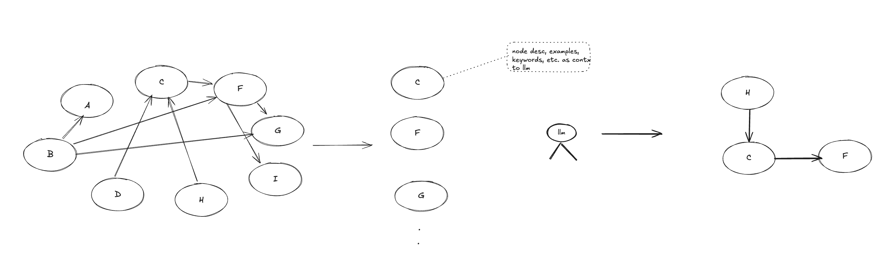
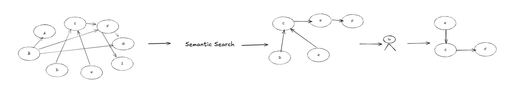

---
Solution 1: You break the edges betwen the nodes and provide the nodes to llm, llm will provide the suitable nodes to answer the given user query. Once the selected nodes are available construct the edges back to make a subgraph. 

---
Solution: 2 for finding the right subgraph for a given user question

## Implementation Phases
### Phase - 1
1. Store the information into graph db like neo 4j or apache age
2. Add metadata to the nodes and edges.
3. Add relevant kpis and templates to the nodes or edges.

### Phase -2
1. Write relevant cipher queries to fetch the information from graph db. 
Example: retrieve individual nodes and their metadata. and their linked metadata nodes like kpi and templates.
2. Provide the context of this to llm to filter the relevant nodes.
### Phase - 3
1. Generate sql query by providing the filtered nodes as context to sql gen llm step.
2. execute the sql query and get data.